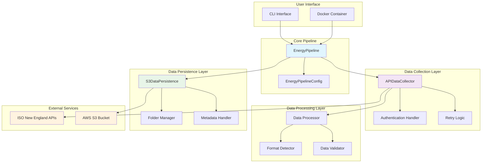
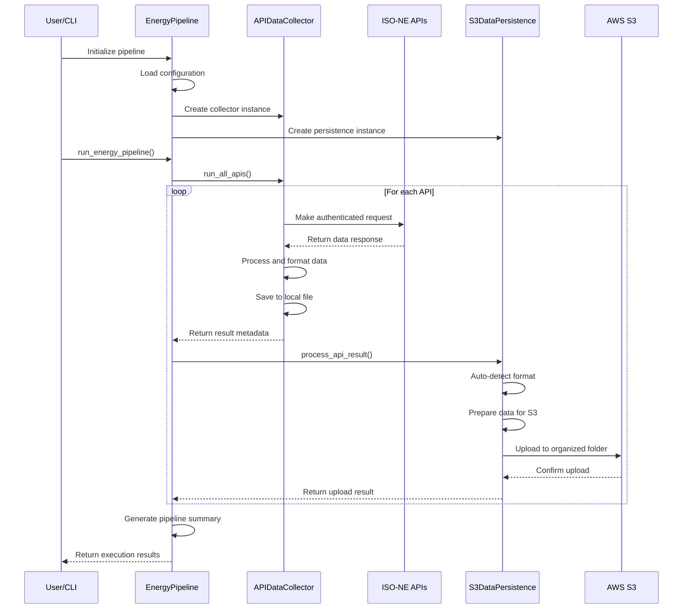
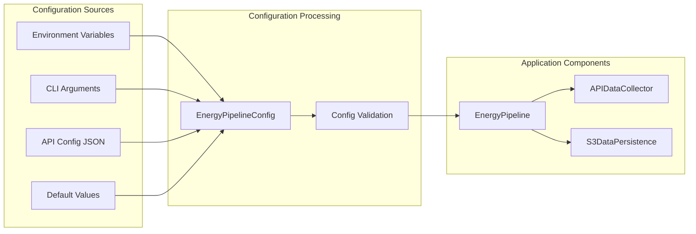

# Energy Data Pipeline

A comprehensive data pipeline for collecting, processing, and persisting energy market data from ISO New England APIs to AWS S3.

## Purpose Statement

This application provides an automated solution for collecting real-time and historical energy market data from ISO New England (ISO-NE) APIs and storing it in AWS S3 for analysis and reporting. The pipeline supports multiple data formats, handles authentication, implements robust error handling, and provides flexible configuration options for different energy data sources.

Key capabilities include:
- **Real-time data collection** from ISO-NE APIs (7-day forecasts, locational marginal pricing, fuel mix, morning reports)
- **Multi-format data persistence** (CSV, JSON, XML, TSV, HTML, Parquet)
- **AWS S3 integration** with organized folder structures
- **Robust error handling** and retry mechanisms
- **Configurable authentication** and API parameters
- **Containerized deployment** with Docker support

## Architecture Overview

The application follows a modular, pipeline-based architecture with clear separation of concerns:



## System Components

### 1. Energy Pipeline Core (`source/app/main.py`)
- **EnergyPipeline**: Main orchestrator class that coordinates data collection and persistence
- **EnergyPipelineConfig**: Configuration management with environment variable support
- Handles CLI argument parsing and execution modes

### 2. Data Collection (`source/app/data_collection/collector.py`)
- **APIDataCollector**: Handles API calls to ISO New England services
- Supports multiple authentication methods (Basic Auth, API Key, Bearer Token)
- Implements retry logic with exponential backoff
- Auto-detects response formats and saves to appropriate file types

### 3. Data Persistence (`source/app/data_persisting/persistence.py`)
- **S3DataPersistence**: Manages data storage to AWS S3
- Supports multiple data formats (CSV, JSON, XML, TSV, HTML, Parquet, YAML)
- Implements folder organization and metadata management
- Handles format auto-detection and data preparation

### 4. Data Processing (`source/app/data_processing/processor.py`)
- Data transformation and validation
- Format conversion and normalization
- Error handling and data quality checks

### 5. Infrastructure Components
- **Lambda Functions** (`source/data_ingestion/lambda/`): Serverless data ingestion
- **Glue ETL Jobs** (`source/data_ingestion/glue_job/`): Data transformation workflows
- **CloudFormation Templates** (`source/infrastructure/cloudformation/`): Infrastructure as Code
- **Terraform Configuration** (`source/infrastructure/terraform/`): Alternative IaC approach

## Data Flow Architecture



## Configuration Management

The application uses a layered configuration approach:



### Environment Variables
- `S3_BUCKET_NAME`: Target S3 bucket for data storage
- `AWS_DEFAULT_REGION`: AWS region for S3 operations
- `API_CONFIG_FILE`: Path to API configuration JSON
- `DEFAULT_ENERGY_REGION`: Default energy region for processing
- `DATA_FILE_PREFIX`: Prefix for generated data files

### API Configuration (`api_config.json`)
```json
{
  "apis": [
    {
      "name": "7 day forecast all zones",
      "description": "ISO New England 7-Day Forecast",
      "url": "https://webservices.iso-ne.com/api/v1.1/sevendayforecast/current",
      "method": "GET",
      "auth_type": "basic",
      "username": "steveg93@gmail.com",
      "timeout": 30,
      "output_folder": "iso_ne_current_7_day_forecast",
      "csv_prefix": "demand"
    }
  ]
}
```

## Supported Data Sources

### ISO New England APIs
1. **7-Day Forecast** (`/sevendayforecast/current`)
   - Demand forecasts for all load zones
   - Output: `iso_ne_current_7_day_forecast/demand_*.csv`

2. **Hourly DA LMP Final** (`/hourlylmp/da/final`)
   - Day-ahead locational marginal pricing
   - Output: `hourly_final_lmp/hourly_final_lmp_*.csv`

3. **Fuel Mix** (`/genfuelmix/current`)
   - Current generation fuel mix
   - Output: `iso_ne_fuel_mix/fuel_mix_*.csv`

4. **Morning Report** (`/morningreport/day/{day}`)
   - Daily operational reports
   - Output: `iso_ne_morning_report/morning_report_*.csv`

## Data Formats and Storage

### Supported Output Formats
- **CSV**: Tabular data with headers
- **JSON**: Structured data with nested objects
- **XML**: Hierarchical markup format
- **TSV**: Tab-separated values
- **HTML**: Web-ready formatted tables
- **Parquet**: Columnar storage format
- **YAML**: Human-readable structured data
- **Plain Text**: Raw text content

### S3 Organization Structure
```
s3://s3-for-energy/
├── iso_ne_current_7_day_forecast/
│   ├── demand_20250714_123456_abc123.csv
│   └── demand_20250714_124500_def456.csv
├── hourly_final_lmp/
│   ├── hourly_final_lmp_20250714_123456_abc123.csv
│   └── hourly_final_lmp_20250714_124500_def456.csv
├── iso_ne_fuel_mix/
│   ├── fuel_mix_20250714_123456_abc123.csv
│   └── fuel_mix_20250714_124500_def456.csv
└── iso_ne_morning_report/
    ├── morning_report_20250714_123456_abc123.csv
    └── morning_report_20250714_124500_def456.csv
```

## Installation and Setup

### Prerequisites
- Python 3.8+
- AWS CLI configured with appropriate credentials
- Access to ISO New England API services

### Local Installation
```bash
# Clone the repository
git clone <repository-url>
cd Energy-Data-Pipeline/project_files

# Install dependencies
pip install -r requirements.txt

# Configure AWS credentials
aws configure

# Set environment variables
export S3_BUCKET_NAME="your-s3-bucket"
export AWS_DEFAULT_REGION="us-east-1"
```

### Docker Installation
```bash
# Build the container
docker-compose build

# Run the container
docker-compose up

# Execute pipeline in container
docker-compose exec python-app python source/app/main.py --all
```

## Usage Examples

### Command Line Interface
```bash
# Run all configured APIs
python source/app/main.py --all

# Run specific API
python source/app/main.py --api "7 day forecast all zones"

# Run for specific region
python source/app/main.py --region northeast

# Use custom configuration
python source/app/main.py --config custom_api_config.json
```

### Programmatic Usage
```python
from source.app.main import EnergyPipeline, EnergyPipelineConfig

# Initialize pipeline
config = EnergyPipelineConfig()
pipeline = EnergyPipeline(config)

# Run single API
result = pipeline.run_single_api("7 day forecast all zones")

# Run all APIs
results = pipeline.run_all_apis()

# Run complete pipeline
summary = pipeline.run_energy_pipeline("northeast")
```

## Error Handling and Monitoring

### Retry Logic
- HTTP requests implement exponential backoff
- Configurable retry counts and timeouts
- Graceful handling of network failures

### Logging
- Structured logging with timestamps
- File and console output
- Configurable log levels
- Error tracking and debugging information

### Error Recovery
- Individual API failures don't stop the pipeline
- Detailed error reporting in results
- Continuation of processing for successful APIs

## Security Considerations

### Authentication
- HTTP Basic Authentication for ISO-NE APIs
- Support for API key and Bearer token authentication
- Secure password handling with GUI/console prompts

### Data Security
- SSL/TLS disabled for development (configurable)
- AWS IAM-based access control for S3
- Environment variable-based credential management

### Access Control
- AWS credential chain for authentication
- Principle of least privilege for S3 access
- Optional AWS profile support

## Performance and Scalability

### Optimization Features
- Connection pooling and session reuse
- Concurrent API calls where possible
- Efficient data format conversion
- Streaming data processing for large datasets

### Scalability Options
- AWS Lambda integration for serverless processing
- Glue ETL jobs for large-scale transformations
- Horizontal scaling with multiple pipeline instances

## Deployment Options

### Development Environment
- Local Python execution
- Docker container for consistency
- Direct API testing and debugging

### Production Environment
- AWS Lambda for scheduled execution
- ECS/Fargate for containerized deployment
- CloudFormation/Terraform for infrastructure management

## Monitoring and Maintenance

### Health Checks
- S3 bucket accessibility validation
- API endpoint connectivity testing
- Configuration validation on startup

### Maintenance Tasks
- Regular cleanup of old data files
- Configuration updates for new APIs
- Credential rotation and security updates

## Contributing

### Development Setup
1. Fork the repository
2. Create a feature branch
3. Make changes with appropriate tests
4. Submit a pull request

### Code Standards
- Follow PEP 8 style guidelines
- Include comprehensive docstrings
- Add unit tests for new features
- Update documentation as needed

## License

This project is licensed under the MIT License. See the LICENSE file for details.

## Support

For issues and questions:
- Check the troubleshooting section
- Review the logs for error details
- Submit an issue in the repository

## Version History

- **v1.0.0**: Initial release with basic pipeline functionality
- **v1.1.0**: Added multi-format support and improved error handling
- **v1.2.0**: Enhanced AWS integration and Docker support