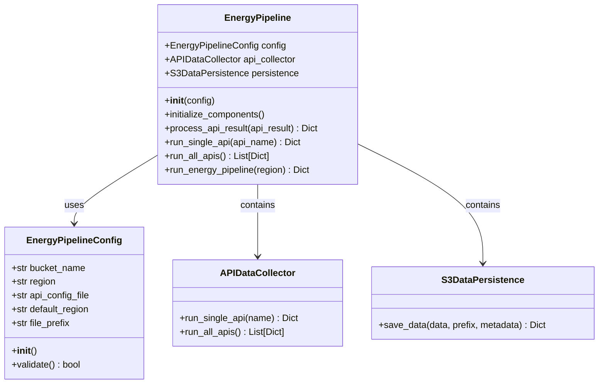
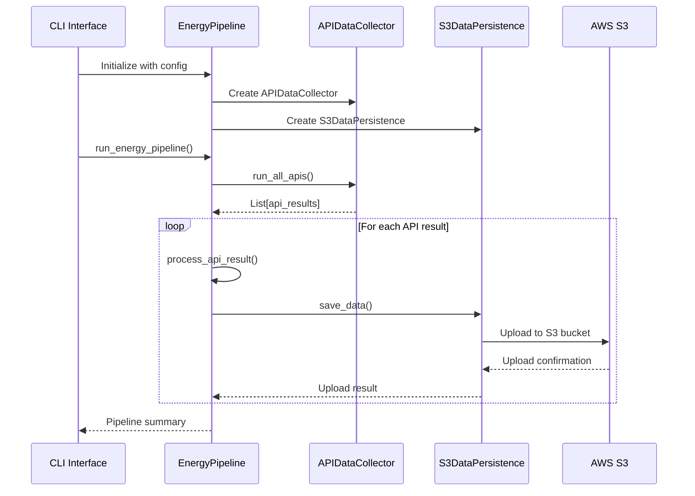
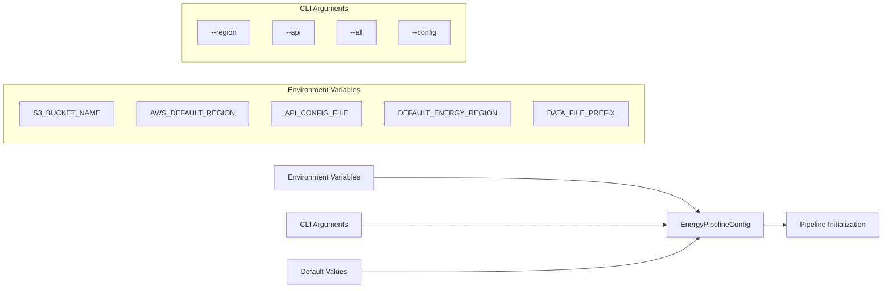
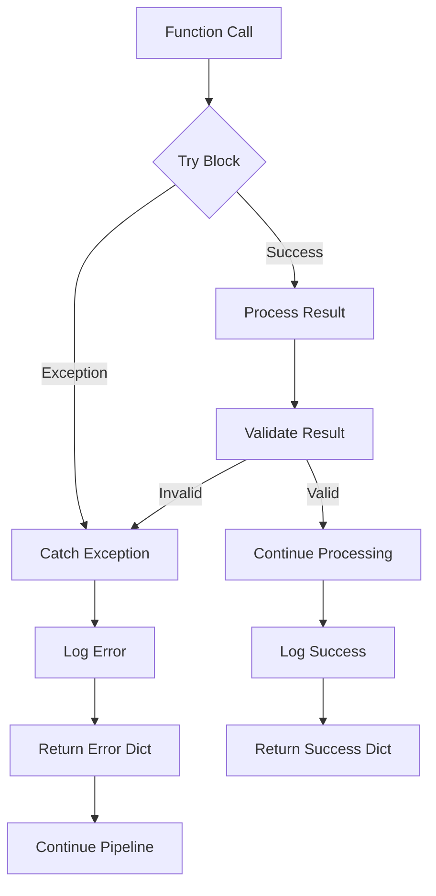

# Energy Pipeline Architecture Diagram

## Class Structure



## Execution Flow

```mermaid
flowchart TD
    A[main()] --> B{Parse CLI Args}
    B --> C[Create EnergyPipelineConfig]
    C --> D[Initialize EnergyPipeline]
    D --> E{Execution Mode}
    
    E -->|--api| F[run_single_api()]
    E -->|--all| G[run_all_apis()]
    E -->|default| H[run_energy_pipeline()]
    
    F --> I[APIDataCollector.run_single_api()]
    G --> J[APIDataCollector.run_all_apis()]
    H --> J
    
    I --> K[process_api_result()]
    J --> L[Loop: process_api_result()]
    L --> K
    
    K --> M[S3DataPersistence.save_data()]
    M --> N[Log Results]
    N --> O[Return Summary]
```

## Data Flow



## Configuration Management



## Error Handling Strategy



## Component Dependencies

```mermaid
graph TB
    subgraph "External Dependencies"
        A[boto3 - AWS SDK]
        B[pandas - Data Processing]
        C[logging - Python Logging]
        D[argparse - CLI Parsing]
    end
    
    subgraph "Internal Modules"
        E[data_collection.collector]
        F[data_persisting.persistence]
    end
    
    subgraph "Main Pipeline"
        G[EnergyPipelineConfig]
        H[EnergyPipeline]
        I[main()]
    end
    
    A --> F
    B --> E
    B --> F
    C --> H
    D --> I
    E --> H
    F --> H
    G --> H
    H --> I
```

## Logging Architecture

```mermaid
graph LR
    A[Logger Configuration] --> B[StreamHandler]
    A --> C[FileHandler]
    
    B --> D[Console Output]
    C --> E[energy_pipeline.log]
    
    F[Pipeline Events] --> G[logger.info()]
    F --> H[logger.error()]
    F --> I[logger.warning()]
    
    G --> A
    H --> A
    I --> A
```